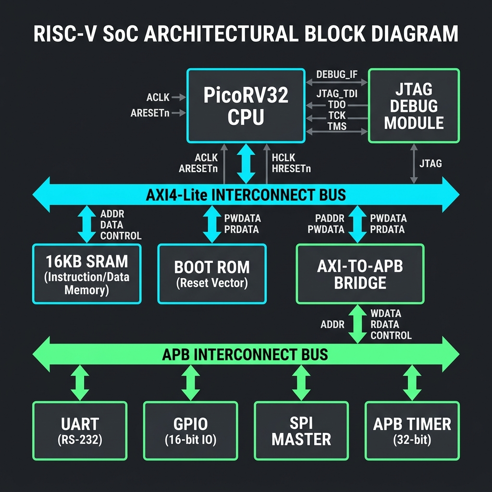
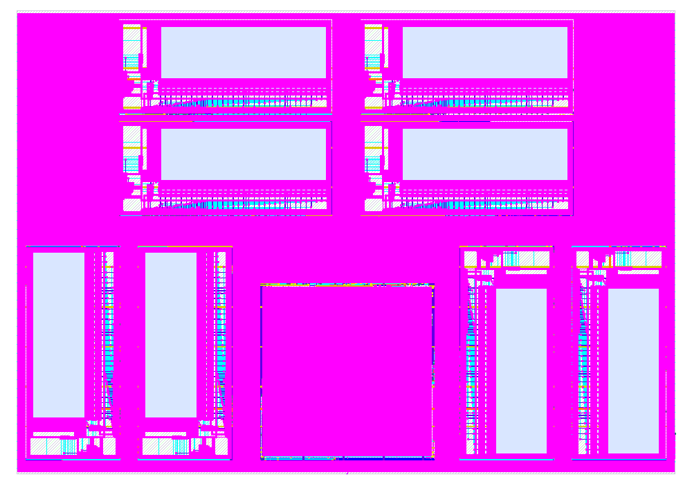
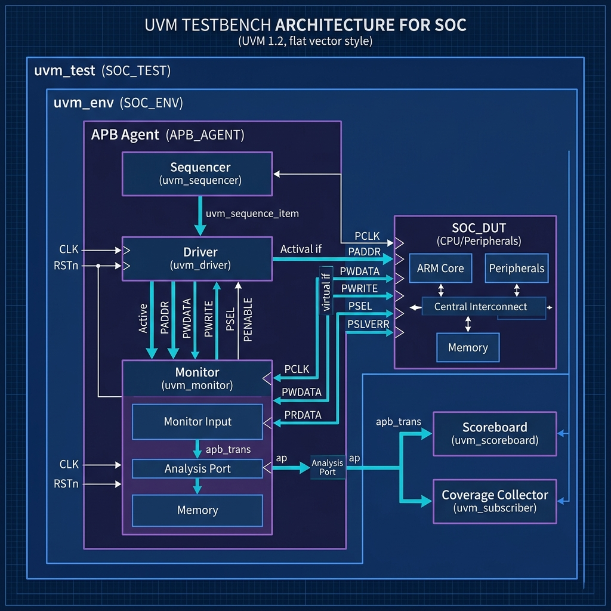
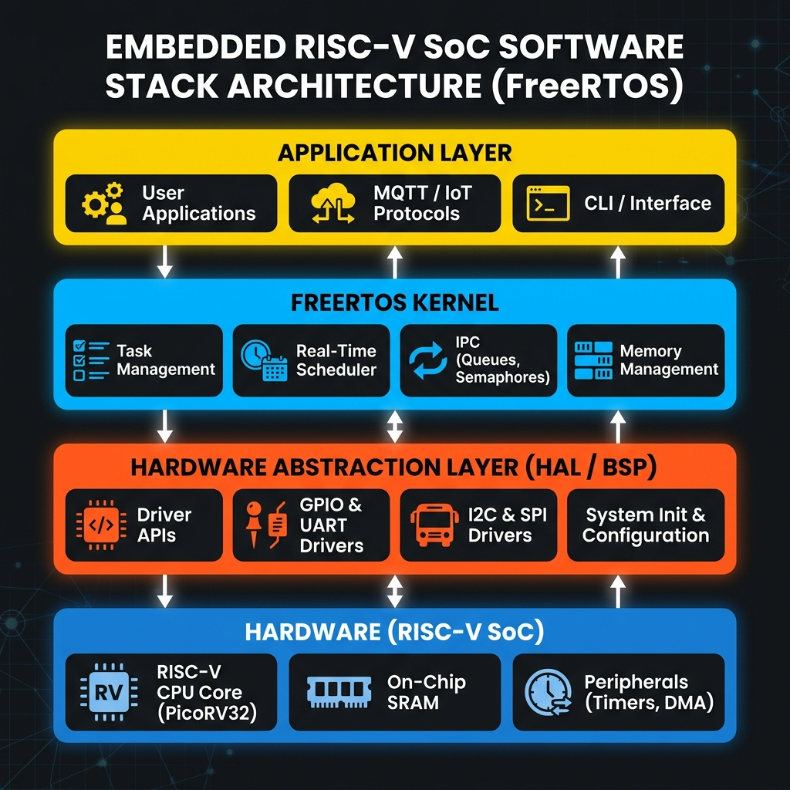

# PicoRV32 RISC-V SoC

[](LICENSE)
[]()
[]()
[]()
[]()

A production-quality, fully open-source **RV32IM SoC** built around the [PicoRV32](https://github.com/YosysHQ/picorv32) core. Ships with a FreeRTOS firmware port, a UVM verification environment, JTAG/OpenOCD software debug, and a complete ASIC implementation flow targeting **SkyWater sky130**.

---

## Feature Highlights

| Feature | Detail |
|---|---|
| **CPU** | PicoRV32 (RV32IM — hardware multiply/divide enabled), AXI4-Lite master |
| **Memory** | 32 KB SRAM (AXI slave) + 256 B Boot ROM |
| **Bus** | AXI4-Lite 2-master interconnect + AXI→APB bridge |
| **Peripherals** | UART, GPIO (32-bit), SPI master, APB Timer |
| **Interactive Shell** | **FreeRTOS+CLI** command-line interface over UART (`help`, `ver`, `status`, `memread`, `gpio`) |
| **Debug** | RISC-V Debug Module 0.13-style, JTAG tap, Remote-Bitbang |
| **RTOS** | FreeRTOS 10.x with PicoRV32-specific port |
| **Verification** | Full UVM env: APB agent, scoreboard, functional coverage, reg model |
| **ASIC Flow** | Yosys synthesis → OpenROAD P&R → OpenLane wrapper (sky130B PDK) |
| **SRAM Macro** | OpenRAM-generated sky130 4 KB SRAM with Liberty + LEF views |

---

## Architecture Overview



```
                     ┌─────────────────────────────────────────────┐
                     │                  soc_top.sv                 │
                     │                                             │
  JTAG ──────────────►  Debug Module (dm_top)  ◄──────────────────┐│
  (TCK/TMS/TDI/TDO)  │       │  system_bus_access                 ││
                     │       ▼                                     ││
                     │  ┌─────────────┐    AXI4-Lite               ││
                     │  │  PicoRV32   ├──────────────────────────┐ ││
                     │  │  (RV32IM)   │   M0 (CPU)               │ ││
                     │  └─────────────┘                          │ ││
                     │                     M1 (Debug SBA)        │ ││
                     │  ┌────────────────────────────────────┐   │ ││
                     │  │    AXI Interconnect (2M × 2S)      │◄──┘ ││
                     │  └──────────────┬──────────────┬──────┘     ││
                     │                 │              │             ││
                     │         ┌───────▼──────┐  ┌───▼──────────┐  ││
                     │         │  SRAM (32KB) │  │  AXI→APB     │  ││
                     │         │  sram_axi.sv │  │   Bridge     │  ││
                     │         └──────────────┘  └──────┬───────┘  ││
                     │                                  │           ││
                     │           APB4 Bus ──────────────┘           ││
                     │      ┌──────┬───────┬──────┬────────────┐    ││
                     │   UART  GPIO  Timer   SPI  Debug APB     │    ││
                     │  (0x20M)(0x20M)(0x20M)(0x20M)(0x20M)    │    ││
                     └─────────────────────────────────────────────┘│
                                                                     │
                     Boot ROM (256B, address 0x0000_0000)  ──────────┘
```

### Memory Map

| Region | Base Address | Size | Notes |
|---|---|---|---|
| Boot ROM | `0x0000_0000` | 256 B | XIP, read-only |
| SRAM | `0x0001_0000` | 32 KB | RWXC |
| APB UART | `0x2000_0000` | 4 KB | 115200 default |
| APB GPIO | `0x2000_1000` | 4 KB | 32-bit I/O |
| APB Timer | `0x2000_2000` | 4 KB | 1 ms FreeRTOS tick |
| APB SPI | `0x2000_3000` | 4 KB | Master, full duplex |
| Debug APB | `0x2000_4000` | 4 KB | Internal debug regs |

---

## Repository Layout

```
riscv-soc/
├── rtl/
│   ├── soc_top.sv              Top-level SoC integration
│   ├── core/
│   │   └── picorv32_axi.sv     PicoRV32 + AXI4-Lite adapter
│   ├── interconnect/
│   │   └── axi_interconnect_2m.sv  2-master AXI switch
│   ├── memory/
│   │   └── sram_axi.sv         32 KB SRAM AXI slave
│   ├── boot/
│   │   └── boot_fsm.sv         Boot ROM + FSM
│   ├── peripherals/
│   │   ├── uart_ctrl_apb.sv    UART
│   │   ├── gpio_apb.sv         GPIO
│   │   ├── timer_apb.sv        Timer
│   │   ├── spi_master_apb.sv   SPI
│   │   └── debug/              Debug Module (RISC-V 0.13)
│   └── asic/
│       └── soc_core.sv         ASIC-hardened top (without pad ring)
├── firmware/
│   ├── main.c                  FreeRTOS demo (tasks + UART/GPIO/Timer + CLI)
│   ├── start.S                 Reset vector, IRQ wrapper, CSR init
│   ├── FreeRTOSConfig.h        Tick rate, heap size, stack config
│   ├── FreeRTOS-Kernel/        FreeRTOS 10.x kernel sources
│   ├── cli/                    FreeRTOS+CLI shell (FreeRTOS_CLI.c + cli_task.c)
│   ├── port/                   PicoRV32 FreeRTOS port (port.c)
│   ├── boot/                   Boot ROM C source
│   ├── drivers/                Peripheral register-level drivers
│   ├── lib/                    Utility library (printf, etc.)
│   ├── libc/                   Minimal libc shims
│   ├── linker.ld               SRAM linker script
│   ├── linker_bootrom.ld       Boot ROM linker script
│   └── Makefile
├── sim/
│   ├── main.cpp                Verilator harness (JTAG RBB + interactive UART bridge)
│   ├── Makefile
│   └── bootrom.hex             Pre-built boot ROM image
├── tb/                         Icarus Verilog unit + integration TBs
│   ├── soc_top_tb.sv
│   ├── soc_top_bringup_tb.sv
│   ├── timer_apb_tb.sv
│   ├── gpio_apb_tb.sv
│   ├── uart_ctrl_apb_tb.sv
│   └── tb_spi.sv
├── uvm/                        UVM verification environment
│   ├── env/                    APB agent, scoreboard, coverage, reg model
│   ├── seq/                    Sequences (UART/GPIO/Timer/SPI/smoke/stress)
│   ├── tests/                  UVM test classes
│   ├── tb/                     Testbench tops
│   ├── soc_uvm_pkg.sv
│   ├── Makefile
│   └── README.md               UVM-specific documentation
├── openocd/
│   ├── openocd.cfg             JTAG + Remote-Bitbang config
│   └── gdb_init.cfg            GDB init script
├── flow/                       Yosys + OpenSTA + OpenROAD scripts
├── openlane/                   OpenLane design wrapper (sky130B)
│   └── designs/soc_core_prod/  config.json, pin_order, base_sdc
├── openram/                    OpenRAM SRAM macro generator
│   ├── config.py
│   └── generate_views.py
├── constraints/
│   └── soc_core.sdc            Timing constraints (50 MHz)
├── docs/
│   └── HOW_TO_RUN.md           Detailed simulation + debug guide
├── scripts/
│   └── verilog_hex_to_memh.py  Firmware hex → Verilog $readmemh format
├── Makefile                    Top-level build orchestration
├── LICENSE
└── THIRD_PARTY_NOTICES.md
```

---

## Quick Start

### Prerequisites

```bash
# Simulation
sudo apt install verilator iverilog gtkwave

# RISC-V toolchain (see https://github.com/riscv-collab/riscv-gnu-toolchain)
# Minimum: riscv32-unknown-elf-gcc 12+, riscv32-unknown-elf-gdb

# Debug
sudo apt install openocd   # or build riscv-openocd from source
```

### 1. Build Firmware

```bash
make firmware
# or explicitly:
make -C firmware APP=firmware APP_SRC=main.c
# → firmware/firmware.elf, firmware/firmware.hex
```

### 2. Run Unit Simulations (Icarus)

```bash
make sim          # All peripheral unit tests
make sim_soc      # SoC integration test
```

### 3. Run Verilator Simulation + Interactive FreeRTOS+CLI

The Verilator harness bridges the SoC UART pins to your terminal (keystrokes →
`uart_rx`, `uart_tx` → stdout), giving a live command shell over the modelled UART.

```bash
make run
# Starts Verilator simulation + Remote-Bitbang listener on :9824
# The FreeRTOS+CLI banner and "skyforge> " prompt appear in the terminal.
```

Type commands directly into the terminal:

```text
=== SkyForge CLI ===
skyforge> help            # list all registered commands
skyforge> ver             # firmware/SoC banner
skyforge> status          # uptime, task count, heap usage
skyforge> memread 0x20002000   # read a 32-bit word at a hex address
skyforge> gpio 0x000000ff      # drive GPIO_OUT with a 32-bit value
```

The `vTaskA`/`vTaskB` GPIO blinkers keep running concurrently while you type —
demonstrating preemptive multitasking alongside the interactive shell.

> Tip: set `SIM_QUIET=1` to suppress the `[SIM]` diagnostic prints for a clean
> console, e.g. `SIM_QUIET=1 ./sim/obj_dir_firmware/Vsoc_top`.
> See [docs/FREERTOS_CLI_INTEGRATION.md](docs/FREERTOS_CLI_INTEGRATION.md) for the
> full integration write-up.

### 4. JTAG Debug with OpenOCD + GDB

Open three terminals:

**Terminal 1 — Simulation:**
```bash
make run
# Wait for: [RBB] Listening on localhost:9824
```

**Terminal 2 — OpenOCD:**
```bash
make openocd
# or: openocd -f openocd/openocd.cfg
# Wait for: Listening on port 3333 for gdb connections
```

**Terminal 3 — GDB:**
```bash
make gdb
# or: riscv32-unknown-elf-gdb firmware/firmware.elf -ex "target extended-remote :3333"
(gdb) load
(gdb) break main
(gdb) continue
(gdb) break vTaskA       # break inside a FreeRTOS task
(gdb) info registers
```

Detailed instructions: [docs/HOW_TO_RUN.md](docs/HOW_TO_RUN.md)

---

## ASIC Implementation Flow

> **Full implementation report → [docs/ASIC_IMPLEMENTATION.md](docs/ASIC_IMPLEMENTATION.md)**

| Metric | Value |
|---|---|
| Process | SkyWater sky130B (130 nm) |
| Die area | 1800 × 1350 µm (2.43 mm²) |
| Clock | 100 MHz target — **timing closed** ✅ |
| Setup WNS | ≥ 0 ns |
| SRAM macros | 4 × 4 KB (2×2 array, OpenRAM-generated LEF/LIB) |
| DRC violations | **0** ✅ |
| LVS | SRAM blackboxed (stub GDS); logic cells clean |
| PDN IR drop | < 40 mV estimated (< 2.8 % Vdd) |
| Total std cells | ~6 000 |



*SkyWater sky130 GDSII of the PicoRV32 SoC — 4 SRAM macros (top 2×2 array) + standard-cell logic (bottom).*

### Option A — Standalone Scripted Flow (Yosys + OpenROAD)

```bash
# Prerequisites: yosys, openroad, opensta installed and on PATH
make pd-flow
# Outputs in flow/out/: synthesized netlist, timing reports, DEF, GDS
```

See [flow/README.md](flow/README.md) for step-by-step details.

### Option B — OpenLane (Docker recommended)

```bash
# Prerequisites: Docker + OpenLane installed
# See: https://github.com/The-OpenROAD-Project/OpenLane

cd openlane
make                        # runs OpenLane on designs/soc_core_prod
# Results in: designs/soc_core_prod/runs/<timestamp>/
```

The design configuration (`config.json`) targets:
- PDK: `sky130B`
- Clock: `clk`, period = 20 ns (50 MHz)
- Die area: auto-floorplan from utilization

See [openlane/README.md](openlane/README.md) for full details and viewing GDSII.

### Option C — Generate SRAM Macro with OpenRAM

```bash
# Prerequisites: OpenRAM installed, sky130 PDK available
export OPENRAM_HOME=/path/to/openram
export OPENRAM_TECH=sky130

cd openram
python3 generate_views.py
# Outputs: build/sky130_sram_4kbyte_*.lef, .lib, .v
```

---

## UVM Verification



The `uvm/` directory contains a complete UVM-1.2 environment for the APB peripheral subsystem.

```bash
cd uvm

# Unit tests (require VCS, Questa, or Xcelium + UVM_HOME set)
make uart  SIM=questa
make gpio  SIM=vcs
make timer SIM=xcelium
make spi

# Full SoC tests
make soc_smoke    # Exercises all 5 peripherals, targets 100% functional coverage
make soc_stress   # 200+ randomized cross-peripheral transactions

# Coverage merge + report
make cov SIM=questa   # → cov_report/
```

See [uvm/README.md](uvm/README.md) for the full environment description, register map, and scoreboard details.

---

## FreeRTOS Port Details



The firmware demonstrates:
- Two FreeRTOS tasks (`vTaskA`, `vTaskB`) sharing a mutex
- 1 ms periodic timer tick (`xPortSysTickHandler`) driven by the APB Timer IRQ
- UART printf output via a custom minimal libc
- GPIO toggle from tasks
- Context switch through RISC-V `mret` + custom `port.c`

Key files:
- `firmware/port/port.c` — FreeRTOS PicoRV32 port (context switch, CSR handling)
- `firmware/FreeRTOSConfig.h` — Configuration (tick rate, heap, priorities)
- `firmware/start.S` — Reset vector, interrupt dispatch table

---

## Contributing

Contributions are very welcome! Please read [CONTRIBUTING.md](CONTRIBUTING.md) before submitting a pull request.

**Good first issues:**
- Add more UVM test sequences (SPI stress, UART loopback)
- Add a `flow/` README with synthesis results table
- Improve FreeRTOS port to support more interrupt sources
- Add a second SRAM bank or expand memory map
- Integrate a simple DMA controller

**Reporting bugs:** Use the [GitHub issue tracker](.github/ISSUE_TEMPLATE). Please include simulation logs, waveform screenshots (if applicable), and the exact `make` command that reproduces the issue.

---

## License

This project is licensed under the MIT License — see [LICENSE](LICENSE) for details.

Third-party components (PicoRV32, FreeRTOS kernel, UVM base classes) retain their own licenses. See [THIRD_PARTY_NOTICES.md](THIRD_PARTY_NOTICES.md) for a full list.

---

## Acknowledgements

- [PicoRV32](https://github.com/YosysHQ/picorv32) by Claire Xen (YosysHQ) — the heart of this SoC
- [FreeRTOS](https://www.freertos.org/) — RTOS kernel
- [OpenLane](https://github.com/The-OpenROAD-Project/OpenLane) — RTL-to-GDS flow
- [OpenRAM](https://openram.org/) — Open-source SRAM compiler
- [SkyWater sky130 PDK](https://github.com/google/skywater-pdk) — Open process design kit
