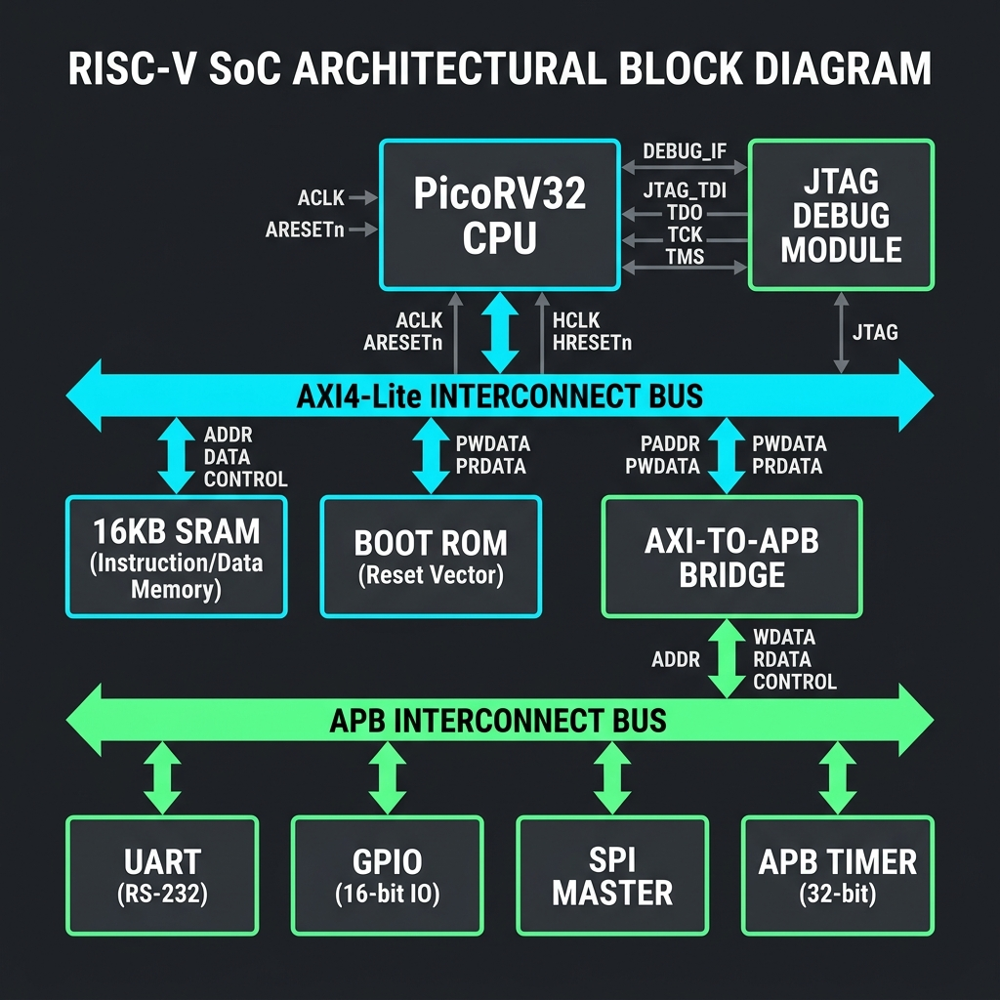

<p align="center">
  <h1 align="center">SkyForge RISC-V SoC</h1>
  <p align="center">
    A fully open-source, silicon-ready RV32IM System-on-Chip targeting SkyWater sky130A
  </p>
</p>

<p align="center">
  <a href="LICENSE"></a>
  
  
  
  
  
  
  
</p>

---

## Overview

**SkyForge** is a fully open-source **RISC-V System-on-Chip** built around the [PicoRV32](https://github.com/YosysHQ/picorv32) core (RV32IM — integer base + hardware multiply/divide). The design has been taken all the way from RTL to a **silicon-ready GDSII** on the **SkyWater sky130A** open process design kit, with all physical design checks passing cleanly.

The ASIC physical implementation runs entirely through the **[LibreLane](https://github.com/librelane/librelane)** RTL-to-GDS flow inside the **[IIC-OSIC-TOOLS](https://github.com/iic-jku/IIC-OSIC-TOOLS) Docker container** (`hpretl/iic-osic-tools:chipathon26`). SkyForge is developed as part of the **[IEEE SSCS Chipathon 2026](https://www.chipathon.org/)**.

The SoC boots **FreeRTOS 10.x** with an interactive UART command shell, supports **JTAG/OpenOCD** debug (RISC-V Debug Module 0.13), and executes code in-place from external QSPI flash through an on-chip instruction cache.

> 🐳 **Docker is the only supported flow.** All EDA tools (Yosys, OpenROAD, Magic, Netgen, KLayout, OpenSTA, Verilator) run inside the IIC-OSIC-TOOLS container. See [`instructions/`](instructions/) for full setup guides.

---

## Signoff Status

All physical design checks passed in production run **`RUN_4_GDS_SIGNOFF`** (sky130A, 100 MHz target):

| Check | Tool | Result | Notes |
|:------|:-----|:-------|:------|
| **Magic DRC** | Magic 8.x (sky130A) | ✅ **0 violations** | Abstract DRC (macros blackboxed) |
| **KLayout DRC** | KLayout (`sky130A` mr.drc) | ✅ **0 violations** | Cell-scoped OpenRAM SRAM waiver — see [docs/WAIVED_CHECKS.md](docs/WAIVED_CHECKS.md) |
| **LVS** | Netgen | ✅ **0 errors** — *"Circuits match uniquely"* | Fully clean, no waiver required |
| **STA (Setup)** | OpenSTA | ✅ **WNS ≥ 0** | Timing closed at 100 MHz, TT/1.8 V/25 °C |
| **STA (Hold)** | OpenSTA | ✅ **0 violations** | |
| **Routing DRC** | OpenROAD | ✅ **0 errors** | |
| **Antenna** | OpenROAD | ✅ **0 violations** | Diodes inserted during detailed routing |

**Key metrics:** `klayout__drc_error__count = 0` · `design__lvs_error__count = 0` · `route__drc_errors = 0`

Full waiver documentation and engineering justification: [docs/WAIVED_CHECKS.md](docs/WAIVED_CHECKS.md).

---

## Feature Highlights

| Feature | Detail |
|:--------|:-------|
| **CPU** | PicoRV32 (RV32IM — hardware multiply/divide enabled), AXI4-Lite master interface |
| **On-chip memory** | 8 KB SRAM (2× 4 KB OpenRAM banks, AXI slave) + 256 B synthesized Boot ROM |
| **Flash** | External QSPI Flash execute-in-place (`flash_xip`) with 512 B direct-mapped I-cache (`icache_512b`) |
| **Bus fabric** | AXI4-Lite 2-master interconnect (CPU + Debug SBA) with address-based routing to 4 slaves |
| **AXI→APB bridge** | Protocol bridge from AXI slave port 3 to the APB peripheral subsystem |
| **Peripherals** | UART (8-byte TX/RX FIFO), GPIO (32-bit with IRQ), SPI master (full-duplex, 4 CS), APB Timer (FreeRTOS tick source) |
| **Debug** | RISC-V Debug Module 0.13, JTAG TAP controller, Remote-Bitbang server for OpenOCD/GDB |
| **RTOS** | FreeRTOS 10.x with interactive CLI over UART (`help`, `ver`, `status`, `memread`, `gpio`) |
| **Verification** | Icarus Verilog unit testbenches for all APB peripherals + full SoC integration test; Verilator harness with interactive UART bridge |
| **ASIC flow** | LibreLane → Yosys + OpenROAD + Magic + Netgen + KLayout on sky130A |
| **SRAM macro** | OpenRAM-generated sky130 4 KB SRAM (×2) with Liberty, LEF, GDS, and SPICE views |
| **Die area** | 1800 × 1550 µm (2.79 mm²), 45% core utilization, 50% placement density |

---

## Architecture



The SoC is composed of two hierarchical levels:

- **`soc_top.sv`** — top-level wrapper with I/O pads and clock/reset distribution
- **`soc_core.sv`** — the ASIC hardening boundary containing all digital logic

```
soc_top.sv
  └── soc_core.sv                      ◄── ASIC boundary (hardened to GDS)
        │
        ├── picorv32_axi                  CPU core (RV32IM, hardened macro)
        │     └── picorv32_pcpi_mul/div   Hardware M-extension co-processors
        │
        ├── axi_interconnect_2m           2-master AXI4-Lite crossbar
        │     ├── Master 0: CPU
        │     └── Master 1: Debug SBA (System Bus Access)
        │
        ├── bootrom                       256 B synthesized ROM (AXI slave 0)
        │
        ├── sram_axi                      8 KB SRAM (AXI slave 1)
        │     ├── sky130_sram_4kbyte      OpenRAM bank 0 (4 KB)
        │     └── sky130_sram_4kbyte      OpenRAM bank 1 (4 KB)
        │
        ├── flash_xip                     QSPI Flash XIP controller (AXI slave 2)
        │     └── icache_512b             512 B direct-mapped I-cache
        │
        ├── axi2apb_bridge                AXI→APB protocol bridge (AXI slave 3)
        │
        ├── apb_interconnect              5-port APB address decoder
        │     ├── uart_ctrl_apb           UART with TX/RX FIFO
        │     ├── timer_apb              Programmable timer (IRQ → FreeRTOS tick)
        │     ├── gpio_apb               32-bit GPIO with per-pin IRQ
        │     ├── spi_master_apb         SPI master (4 chip selects)
        │     └── debug_dm               RISC-V Debug Module 0.13 (APB regs)
        │
        ├── jtag_dtm                      JTAG Debug Transport Module
        │
        └── irq_aggregator                Interrupt controller (5 sources → CPU IRQ)
```

### Memory Map

Directly verified from [`rtl/interconnect/axi_interconnect.sv`](rtl/interconnect/axi_interconnect.sv) and [`rtl/interconnect/apb_interconnect.sv`](rtl/interconnect/apb_interconnect.sv):

| Region | Base Address | End Address | Size | AXI Slave | Description |
|:-------|:-------------|:------------|:-----|:----------|:------------|
| **Boot ROM** | `0x0000_0000` | `0x0000_00FF` | 256 B | S0 | Synthesized ROM, read-only. Initial PC. |
| **SRAM** | `0x0001_0000` | `0x0001_1FFF` | 8 KB | S1 | 2× OpenRAM 4 KB banks (RWX, FreeRTOS heap) |
| **APB Peripherals** | `0x2000_0000` | `0x2000_FFFF` | 64 KB | S3 | Decoded by `apb_interconnect` (below) |
| — UART | `0x2000_0000` | `0x2000_0FFF` | 4 KB | | 8N1, configurable baud divisor |
| — Timer | `0x2000_1000` | `0x2000_1FFF` | 4 KB | | FreeRTOS tick source |
| — GPIO | `0x2000_2000` | `0x2000_2FFF` | 4 KB | | 32-bit I/O with per-pin IRQ |
| — SPI | `0x2000_3000` | `0x2000_3FFF` | 4 KB | | Master, full-duplex, 4 CS lines |
| — Debug APB | `0x2000_4000` | `0x2000_4FFF` | 4 KB | | Debug Module 0.13 registers |
| **Flash XIP** | `0x4000_0000` | `0x40FF_FFFF` | 16 MB | S2 | QSPI flash controller + cached XIP |

---

## Getting Started

### Prerequisites

All tools live inside the **IIC-OSIC-TOOLS** Docker container. **This is the only supported environment.**

| Requirement | Details |
|:------------|:--------|
| **Docker Desktop** | [Linux guide](instructions/linux/install_docker_desktop.md) · [Windows guide](instructions/windows/install_docker_desktop.md) |
| **Container image** | `hpretl/iic-osic-tools:chipathon26` |
| **Host workspace** | `~/eda/designs/sky-forge` (bind-mounted to `/foss/designs/sky-forge` inside the container) |
| **PDK** | `sky130A` at `/foss/pdks/sky130A` (pre-installed in the container) |

### 1. Install Docker

Follow the OS-specific guide in [`instructions/`](instructions/README.md):
- **Linux** → [`instructions/linux/install_docker_desktop.md`](instructions/linux/install_docker_desktop.md)
- **Windows** → [`instructions/windows/install_docker_desktop.md`](instructions/windows/install_docker_desktop.md)

### 2. Clone the Repository

```bash
mkdir -p ~/eda/designs
cd ~/eda/designs
git clone https://github.com/Kishor5115/SkyForge-RISCV-SoC.git sky-forge
cd sky-forge
```

### 3. Start the Container

```bash
# Create and start the container (Linux — X11 mode for GUI tools)
docker run -d \
  --name riscv-soc \
  -v ~/eda/designs/sky-forge:/foss/designs/sky-forge \
  -v /foss/pdks:/foss/pdks \
  -e DISPLAY=$DISPLAY \
  -v /tmp/.X11-unix:/tmp/.X11-unix \
  hpretl/iic-osic-tools:chipathon26 \
  tail -f /dev/null

# Attach a shell inside the container
docker exec -it riscv-soc bash
```

> **Workspace bind-mount:** The host directory `~/eda/designs/sky-forge` maps to `/foss/designs/sky-forge` inside the container. This is the only persistent directory across container updates. For full details see [`instructions/README.md`](instructions/README.md).

### 4. Verify the Setup

```bash
# Inside the container
cd /foss/designs/sky-forge
yosys --version       # Synthesis tool
openroad -version     # Place & route
magic --version       # Layout tool / DRC
netgen -batch         # LVS
klayout -v            # Signoff DRC / GDS viewer
verilator --version   # RTL simulation
```

---

## Running the ASIC Flow

From inside the container:

```bash
cd /foss/designs/sky-forge
python3 librelane/docker_asic_flow.py
```

The flow is **hierarchical** and fully automated:

```
┌─────────────────────────────────────────────────────────────────┐
│  Stage 1: Harden PicoRV32 core as a reusable macro             │
│           (picorv32_core.yaml → GDS/LEF/Liberty)               │
├─────────────────────────────────────────────────────────────────┤
│  Stage 2: Patch soc_core_top.yaml                              │
│           (macro placements, PDN connections, die area)         │
├─────────────────────────────────────────────────────────────────┤
│  Stage 3: SoC-top P&R                                          │
│           Synthesis → Floorplan → Placement → CTS → Routing    │
├─────────────────────────────────────────────────────────────────┤
│  Stage 4: Signoff                                              │
│           Magic DRC · KLayout DRC · Netgen LVS · OpenSTA       │
└─────────────────────────────────────────────────────────────────┘
```

**Configuration files** live in [`librelane/`](librelane/):
- `picorv32_core.yaml` — PicoRV32 macro hardening config
- `soc_core_top.yaml` — SoC-top P&R config (die area, macro placement, pin config)
- `soc_core.sdc` — timing constraints (100 MHz clock)
- `soc_core_pins.cfg` — I/O pin placement
- `pdn_cfg.tcl` — power distribution network
- `sky130A_mr_sram_waived.drc` — KLayout DRC waiver deck for OpenRAM SRAM internals

For the complete physical design history and engineering decisions, see [`docs/PHYSICAL_DESIGN_JOURNEY.md`](docs/PHYSICAL_DESIGN_JOURNEY.md) (if available) and [`docs/WAIVED_CHECKS.md`](docs/WAIVED_CHECKS.md).

---

## Firmware & Simulation

### Building Firmware

The firmware uses the RISC-V GNU toolchain (`riscv32-unknown-elf-gcc`):

```bash
# Build all firmware targets (FreeRTOS demo + tests)
make firmware

# Individual targets
make firmware_default             # FreeRTOS + CLI main application
make firmware_integration_test    # SoC integration test
make firmware_test_gpio           # GPIO peripheral test
```

### Simulation (Icarus Verilog)

```bash
# Run all unit testbenches (GPIO, UART, Timer, SPI) + SoC integration
make sim

# Individual peripheral testbenches
make sim_gpio
make sim_uart
make sim_timer
make sim_spi

# Full SoC integration test
make sim_soc
```

### Simulation (Verilator — Interactive)

The Verilator harness (`sim/main.cpp`) provides an interactive UART bridge:

```bash
# Build and run the Verilator simulation
make run

# Inside the simulation, interact with the FreeRTOS CLI:
#   help        — list available commands
#   ver         — show firmware version
#   status      — show system status
#   memread <addr> — read a memory address
#   gpio <hex>  — set GPIO output value

# For a clean console (suppress RTL trace output):
SIM_QUIET=1 make run
```

### JTAG Debugging

Three-terminal setup:

```bash
# Terminal 1: Start simulation with Remote-Bitbang listener
make run

# Terminal 2: Start OpenOCD
make openocd

# Terminal 3: Start GDB
make gdb
# (gdb) target remote :3333
# (gdb) load
# (gdb) continue
```

OpenOCD configuration: [`openocd/openocd.cfg`](openocd/openocd.cfg).

---

## Repository Structure

```
SkyForge-RISCV-SoC/
│
├── rtl/                          RTL source (SystemVerilog)
│   ├── soc_top.sv                  Top-level wrapper (I/O, clock, reset)
│   ├── asic/
│   │   └── soc_core.sv             ASIC hardening boundary (all digital logic)
│   ├── core/
│   │   ├── picorv32.sv              PicoRV32 CPU core (RV32IM)
│   │   ├── picorv32_axi.sv          AXI4-Lite master adapter
│   │   ├── picorv32_axi_adapter.sv  AXI protocol adapter
│   │   └── picorv32_pcpi.sv         RV32M multiply/divide co-processors
│   ├── interconnect/
│   │   ├── axi_interconnect.sv      1-master AXI crossbar (4 slaves)
│   │   ├── axi_interconnect_2m.sv   2-master arbitrated wrapper
│   │   ├── axi2apb_bridge.sv        AXI→APB protocol bridge
│   │   ├── apb_interconnect.sv      5-port APB address decoder
│   │   └── irq_aggregator.sv        Interrupt controller
│   ├── memory/
│   │   ├── boot_rom.sv              256 B synthesized boot ROM
│   │   ├── sram_axi.sv              8 KB SRAM (2× OpenRAM banks)
│   │   ├── icache_512b.sv           512 B direct-mapped I-cache
│   │   └── sky130_sram_4kbyte_*.sv  OpenRAM SRAM blackbox wrapper
│   ├── peripherals/
│   │   ├── uart/                    UART controller (APB, 8-byte FIFO)
│   │   ├── gpio/                    32-bit GPIO with per-pin IRQ
│   │   ├── timer/                   Programmable timer (FreeRTOS tick)
│   │   ├── spi/                     SPI master (4 CS, full-duplex)
│   │   ├── flash/                   QSPI Flash XIP controller
│   │   └── debug/                   RISC-V Debug Module 0.13 + JTAG DTM
│   └── boot/                       Boot sequence logic
│
├── firmware/                     Firmware (C99 + GAS assembly)
│   ├── main.c                      FreeRTOS demo application
│   ├── start.S                     Boot startup (CSR init, stack setup)
│   ├── linker.ld                   SRAM linker script
│   ├── linker_bootrom.ld           Boot ROM linker script
│   ├── FreeRTOSConfig.h            FreeRTOS kernel configuration
│   ├── FreeRTOS-Kernel/            FreeRTOS 10.x kernel (submodule)
│   ├── port/                       PicoRV32 FreeRTOS port layer
│   ├── cli/                        FreeRTOS+CLI command shell
│   ├── drivers/                    Peripheral driver library
│   ├── libc/                       Minimal C library stubs
│   ├── tests/                      Firmware test applications
│   └── Makefile                    Firmware build system
│
├── sim/                          Verilator simulation harness
│   ├── main.cpp                    Interactive UART bridge + Remote-Bitbang
│   └── Makefile                    Verilator build
│
├── tb/                           Icarus Verilog testbenches
│   ├── gpio_apb_tb.sv              GPIO unit test
│   ├── uart_ctrl_apb_tb.sv         UART unit test
│   ├── timer_apb_tb.sv             Timer unit test
│   ├── tb_spi.sv                   SPI unit test
│   ├── soc_top_tb.sv               Full SoC integration test
│   ├── soc_top_bringup_tb.sv       SoC bring-up smoke test
│   ├── flash_xip_tb.sv             Flash XIP unit test
│   ├── flash_model.sv              SPI flash behavioral model
│   └── ...                         Debug module tests
│
├── librelane/                    LibreLane ASIC flow configuration
│   ├── docker_asic_flow.py         Automated hierarchical flow script
│   ├── picorv32_core.yaml          PicoRV32 macro hardening config
│   ├── soc_core_top.yaml           SoC-top P&R config
│   ├── soc_core.sdc                Timing constraints (100 MHz)
│   ├── soc_core_pins.cfg           Pin placement
│   ├── pdn_cfg.tcl                 Power distribution network config
│   └── sky130A_mr_sram_waived.drc  KLayout DRC waiver deck (SRAM internals)
│
├── openram/                      OpenRAM SRAM macro generation
│   ├── config.py                   SRAM configuration (4 KB, 32×1024)
│   ├── build/                      Generated views (GDS, LEF, Liberty, SPICE)
│   └── README.md                   SRAM generation instructions
│
├── openocd/                      JTAG / OpenOCD configuration
│
├── scripts/                      Build helper scripts
│   └── verilog_hex_to_memh.py      Firmware hex → Verilog $readmemh
│
├── docs/                         Engineering documentation
│   ├── WAIVED_CHECKS.md            Signoff waiver documentation
│   └── block_diagram.png           SoC architecture diagram
│
├── instructions/                 Docker setup guides
│   ├── README.md                   Container setup overview
│   ├── linux/                      Linux Docker Desktop install guide
│   └── windows/                    Windows Docker Desktop install guide
│
├── .github/                      GitHub templates
│   ├── ISSUE_TEMPLATE/             Bug report & feature request templates
│   └── PULL_REQUEST_TEMPLATE.md    PR template
│
├── Makefile                      Top-level build system
├── CHANGELOG.md                  Release history (Keep a Changelog format)
├── CONTRIBUTING.md               Contribution guidelines
├── THIRD_PARTY_NOTICES.md        Third-party license notices
├── LICENSE                       MIT License
└── .gitignore                    Git ignore rules
```

---

## Design Decisions

### Why PicoRV32?

PicoRV32 is a size-optimized RISC-V core designed for FPGA and ASIC targets. Its single-file, self-contained design with an AXI4-Lite master interface makes it ideal for a compact SoC targeting the sky130A process node where area is at a premium.

### Why LibreLane over OpenLane?

LibreLane is the modern successor to OpenLane, offering better integration with the current OpenROAD toolchain and the IIC-OSIC-TOOLS container. The migration from OpenLane/sky130B to LibreLane/sky130A resolved several compatibility issues with the Chipathon 2026 container.

### Why Docker?

The IIC-OSIC-TOOLS container provides all EDA tools at known-good, reproducible versions. This eliminates "works on my machine" issues and ensures anyone can reproduce the full RTL-to-GDS flow with a single `docker run` command.

### Why OpenRAM SRAM?

The sky130A PDK does not include foundry-provided SRAM compilers for academic use. OpenRAM generates SRAM macros with complete Liberty/LEF/GDS views that integrate directly into the LibreLane flow. The 2× 4 KB bank configuration provides 8 KB of on-chip memory — sufficient for the FreeRTOS heap and stack.

---

## Contributing

Contributions are welcome — bug reports, RTL improvements, firmware patches, and documentation updates. Please read [CONTRIBUTING.md](CONTRIBUTING.md) before opening a pull request.

**Quick checklist:**
1. Fork and create a feature branch from `main`
2. Follow the [RTL style guide](CONTRIBUTING.md#rtl-style-guide) (SystemVerilog, `snake_case`, 2-space indent)
3. Add testbenches for new RTL modules in `tb/`
4. Ensure `make sim` passes
5. Update `CHANGELOG.md` and relevant docs
6. Open a PR against `main`

---

## License

This project is released under the **MIT License** — see [LICENSE](LICENSE).

Third-party components retain their own licenses:

| Component | License | Location |
|:----------|:--------|:---------|
| PicoRV32 | ISC | `rtl/core/picorv32.sv` |
| FreeRTOS Kernel | MIT | `firmware/FreeRTOS-Kernel/` |
| FreeRTOS+CLI | MIT | `firmware/cli/` |
| OpenRAM SRAM views | BSD 3-Clause | `openram/build/` |
| SkyWater sky130 PDK | Apache 2.0 | Not bundled (via container) |
| LibreLane | Apache 2.0 | Not bundled (via container) |

Full details: [THIRD_PARTY_NOTICES.md](THIRD_PARTY_NOTICES.md).

---

## Acknowledgements

- **[IEEE SSCS Chipathon 2026](https://www.chipathon.org/)** — program and mentorship
- **[IIC-OSIC-TOOLS](https://github.com/iic-jku/IIC-OSIC-TOOLS)** by Harald Pretl (TU Wien / JKU Linz) — Docker container with all EDA tools
- **[PicoRV32](https://github.com/YosysHQ/picorv32)** by Claire Xen (YosysHQ) — RISC-V CPU core
- **[FreeRTOS](https://www.freertos.org/)** — real-time operating system kernel
- **[LibreLane](https://github.com/librelane/librelane)** / **[OpenROAD](https://theopenroadproject.org/)** — RTL-to-GDS physical implementation flow
- **[OpenRAM](https://github.com/VLSIDA/OpenRAM)** — open-source SRAM compiler
- **[SkyWater sky130 PDK](https://github.com/google/skywater-pdk)** — open process design kit by Google and SkyWater Technology
- **[Yosys](https://github.com/YosysHQ/yosys)**, **[Magic](http://opencircuitdesign.com/magic/)**, **[Netgen](http://opencircuitdesign.com/netgen/)**, **[KLayout](https://www.klayout.de/)** — open-source EDA tools

---

<p align="center">
  <sub>Built with ❤️ for open-source silicon</sub>
</p>
